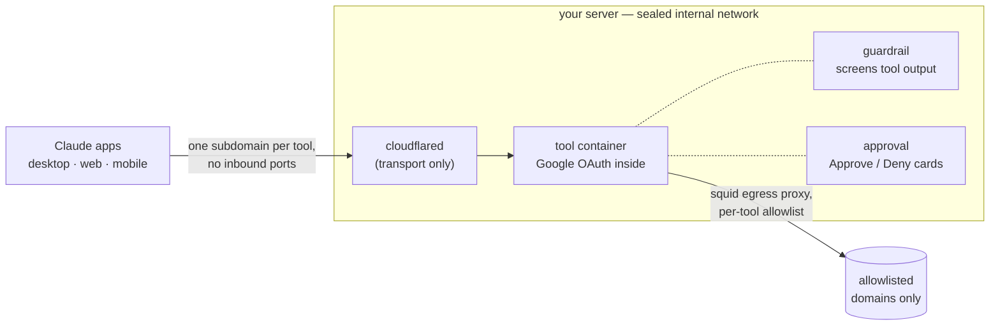

<p align="center">
  
</p>

<h1 align="center">Agent tools, from your server</h1>

<p align="center"><a href="https://agentics.download"><strong>agentics.download</strong></a></p>

Claude arrives with a set of connectors, and the set is chosen for everyone.
The tool that sends your mail, messages from your number, or works a browser
overnight — that one is yours to add.

This repo is a secure framework for adding it: self-hosted
[MCP](https://modelcontextprotocol.io) servers, one container per tool,
reachable from the Claude apps (desktop, web, mobile) through a Cloudflare
Tunnel and gated by Google OAuth. Use the tools included here, add your own —
each gated as tightly or loosely as you decide.

## The tools

Each tool is its own container and its own connector
(`https://<tool>.<your-domain>/mcp`), opt-in via `COMPOSE_PROFILES`. Each one
wraps a proven open-source engine in the shared security stack — OAuth, egress
wall, guardrail, approvals:

| Tool | What it is | Built on |
|---|---|---|
| `browser` | A real web browser as tools, plus a live noVNC view to watch or take over | [microsoft/playwright-mcp](https://github.com/microsoft/playwright-mcp), npm-pinned |
| `workspace` | Google Workspace — Gmail, Drive, Calendar, Docs, Sheets, Slides, Tasks, Chat — as your account | [taylorwilsdon/google_workspace_mcp](https://github.com/taylorwilsdon/google_workspace_mcp), vendored |
| `telegram` | Your Telegram account as tools (read-only by default; writes are opt-in + gated) | [chigwell/telegram-mcp](https://github.com/chigwell/telegram-mcp), vendored + pinned |
| `gatekeeper` | The control plane: per-tool permissions via the in-chat panel | native (always on, like the sidecars) |

Experiments — X, market data, backtesting — live in a separate overlay repo,
[wnkinc/beta-tools](https://github.com/wnkinc/beta-tools), and run on the same
stack.

## How it works



- **One tool per container**, on an internal Docker network with no route to
  the internet. Each tool has its own image, secrets, and subdomain — a bug in
  one stays in one box.
- **Default-deny egress.** The only way out is a squid sidecar enforcing a
  per-tool domain allowlist. A bad dependency can reach its own tool's short
  list of hosts and nothing else.
- **Auth lives in each MCP server** — Google OAuth against a verified-email
  allowlist, fail-closed — so it travels with the image and works the same on
  a laptop or a cloud VM. The tunnel is transport only.
- **A guardrail that proves itself.** A sidecar screens untrusted tool output
  for prompt injection before it reaches model context (local model or Amazon
  Bedrock Guardrails). At startup a canonical injection must block, or the
  container refuses to report healthy.
- **Human approval, out of band.** Gated calls raise an Approve/Deny card in
  the chat, or in a Slack/Discord/Telegram channel you own. Your decision goes
  straight to the approval sidecar, never through the model, so a hijacked
  tool can't approve itself.

## Quick start

```bash
git clone https://github.com/wnkinc/claude-custom-connector-server.git mcp-tools
cd mcp-tools
claude
```

Then say: **"deploy this"** — local box or AWS VM, Claude Code walks the whole
setup.

Just hacking on a tool? `docker compose up --build` runs the stack locally
with auth and tunnel off.

## What you'll need

A Linux box with Docker — or an AWS account and ~$15/mo for the VM Pulumi
provisions — plus a domain on Cloudflare and a Google OAuth client. The full
list, with what each piece is for, is gathered at the top of
**[docs/DEPLOY.md](docs/DEPLOY.md)**.

The one deploy-time decision is which tools to run (`COMPOSE_PROFILES` in
`.env`); permissions, approvals, and adding tools later are all runtime
changes.

## Docs

- **New tool** — `scripts/new-tool.sh` stamps one already wired into the
  substrate; the [`new-tool`](.claude/skills/new-tool/SKILL.md) skill is the
  guide.
- **Deploying** — **[docs/DEPLOY.md](docs/DEPLOY.md)**
- **How it fits together** — **[docs/ARCHITECTURE.md](docs/ARCHITECTURE.md)**
- **Permissions & approvals** — **[docs/GATEKEEPER.md](docs/GATEKEEPER.md)**
